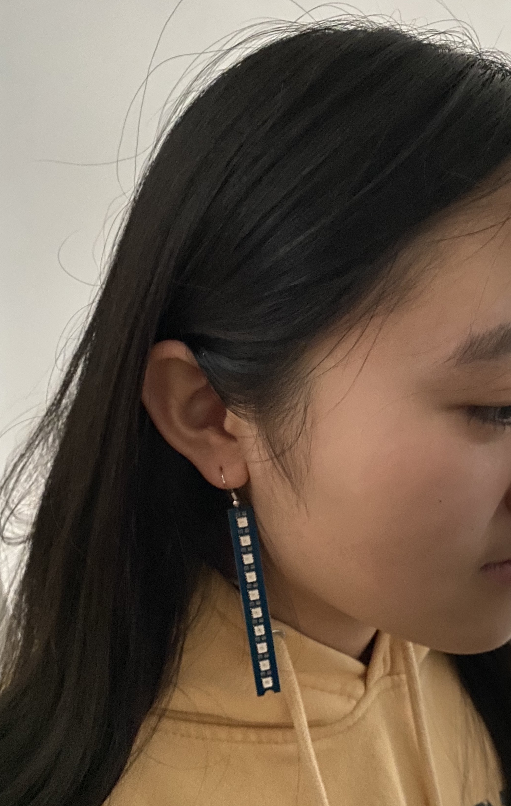
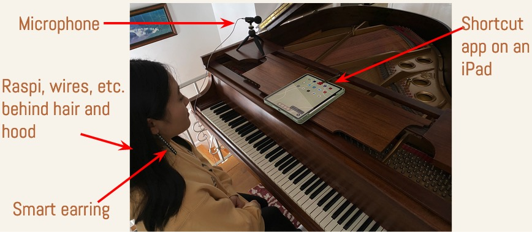

# Smart Earring: Sound-Sensitive and Siri-ready LED Bar for Earrings

This is a a sound-sensitive LED bar for earrings. Its 10 RGB LEDs are controlled by a Raspberry Pi Zero. It "hears” (records) ambient sound and emits lights according to its volume. It emits more lights with red and other loud colors for louder sound. It emits less lights with green and other soft colors for quiet sound. This device is Siri-ready; it runs with a voice command.

  

## Equipment
- Raspberry Pi Zero
- Seeed Studio’s Grove LED bar
- Microphone (USB, wired)
- Earring hook

## Hardware Setup

- Connected an LED bar to Raspi
- Connected a microphone to Raspi
- Put an earring hook to the LED bar.

## Software Setup

- Wrote a Python program that 
  - Records ambient sound every 0.1 second with the “pyaudio” module,
  - Finds the highest amplitude (volume level) in the recorded sound wave, and 
  - Emits different lights with different lights according to its volume. 
- Wrote a Python program that flushes LEDs in white before recording ambient sound. 
- Made a Shortcut app on iPad to run Python code.

## Demo

  

  https://user-images.githubusercontent.com/74394277/223154791-06447fd9-69e3-4f26-82ae-790b14e20efe.mp4
  
  https://user-images.githubusercontent.com/74394277/223155018-8426eb42-3923-483a-b8aa-6d5cc455ebcd.mp4
  
  https://user-images.githubusercontent.com/74394277/223155088-44b4b4ac-7833-4ed5-90e6-81c780a0aa22.mp4

